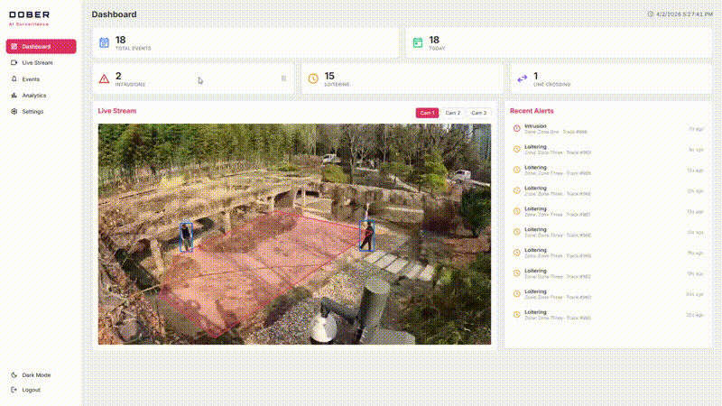
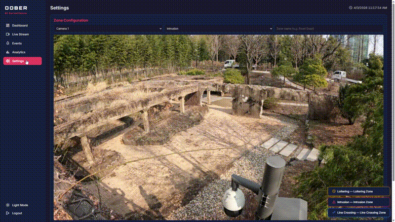

#  DOBER — AI Surveillance System

Real-time edge AI video surveillance system powered by **YOLO11n** and **BoTSORT**, designed for **NVIDIA Jetson Orin Nano Super**. Features object detection, multi-object tracking, event detection, and a full-featured web dashboard.



> **Full Demo Video**: [Watch on YouTube](https://youtu.be/vfH0Grk96vU)

## Features

### AI Pipeline
- **Object Detection** — YOLO11n (~2.6M params) for real-time person/vehicle detection
- **Multi-Object Tracking** — BoTSORT with optimized parameters (track_buffer=90, match_thresh=0.7)
- **Event Detection** — Zone intrusion, loitering (once-per-stay), line crossing with direction tracking
- **Edge Optimized** — TensorRT FP16 on Jetson, PyTorch fallback on PC

### Web Dashboard
- **Live Streaming** — MJPEG-to-WebRTC hybrid with bounding box and zone overlay
- **Multi-Camera View** — 1x1, 1x2, 1x3, 2x2 split modes with drag-and-drop reorder
- **Stream Focus** — Click to enlarge any camera, click again to restore
- **Real-Time Stats** — Event counters (Total, Today, Intrusion, Loitering, Line Crossing) via WebSocket
- **Recent Alerts** — Live event feed with WebSocket push updates
- **Analytics** — Bar chart, pie chart, hourly line chart, per-camera stats table (Recharts)
- **Zone Editor** — Interactive canvas to draw ROI polygons, hot-reload to running streams
- **Event Log** — Filterable event table (All / Intrusion / Loitering / Line Crossing)
- **Dark/Light Mode** — Full theme support including login page
- **Responsive UI** — Tablet and mobile layout adaptation
- **Authentication** — JWT login with bcrypt, protected endpoints, auto token refresh

### Backend
- **FastAPI** REST API with SQLite
- **WebSocket** real-time event push (replaced polling)
- **Singleton Processor** — Single YOLO model shared across all streams
- **Zone Hot-Reload** — Update zones without restarting streams
- **Graceful Shutdown** — Instant Ctrl+C termination (Windows compatible)

## Architecture

```
┌──────────────┐    ┌──────────────────────────────┐    ┌─────────────┐
│ Video Source │───>│        AI Pipeline           │───>│  Dashboard  │
│ RTSP/Webcam/ │    │ YOLO11n → BoTSORT → Events   │    │  React +    │
│ File         │    └──────────┬───────────────────┘    │  Vite       │
└──────────────┘               │                        └──────┬──────┘
                               v                               │
                    ┌──────────────────┐    WebSocket/REST     │
                    │  FastAPI Backend │<──────────────────────┘
                    │  SQLite + JWT    │
                    └──────────────────┘
```

## Tech Stack

| Layer | Technology |
|-------|-----------|
| Detection | Ultralytics YOLO11n |
| Tracking | BoTSORT |
| Backend | FastAPI + SQLite + WebSocket |
| Auth | JWT (python-jose) + bcrypt (passlib) |
| Frontend | React + Vite + Recharts |
| Streaming | MJPEG + WebRTC (aiortc) |
| Deployment | Docker Compose |
| Edge Inference | TensorRT (FP16) on Jetson |

## Project Structure

```
jetson-edge-surveillance/
├── ai/
│   ├── src/
│   │   ├── inference/         # YOLO detection (PyTorch + TensorRT)
│   │   ├── tracking/          # BoTSORT tracker
│   │   ├── events/            # Intrusion, loitering, line crossing
│   │   ├── video/             # Video source handler
│   │   └── pipeline/          # Detection + tracking pipeline
│   └── Dockerfile
├── backend/
│   ├── src/
│   │   ├── routers/           # API endpoints (events, stream, analytics, zones, auth)
│   │   ├── services/          # Event detectors (intrusion, loitering, line crossing)
│   │   ├── auth.py            # JWT utilities, password hashing
│   │   ├── database.py        # SQLite configuration
│   │   ├── models.py          # DB models (Event, DailyCount, ZoneModel, User)
│   │   ├── ws_manager.py      # WebSocket connection manager
│   │   └── main.py            # FastAPI entry point
│   ├── requirements.txt
│   └── Dockerfile
├── frontend/
│   ├── src/
│   │   ├── App.jsx            # Main layout, routing, auth gate
│   │   ├── Login.jsx          # Login/register page
│   │   ├── VideoStream.jsx    # WebRTC/MJPEG video player
│   │   ├── StreamOverlay.jsx  # Event badge overlay
│   │   ├── StatCards.jsx      # Dashboard stat counters
│   │   ├── RecentAlerts.jsx   # Live alert feed
│   │   ├── EventLog.jsx       # Filterable event table
│   │   ├── Analytics.jsx      # Charts and per-camera stats
│   │   ├── ZoneConfig.jsx     # Interactive zone editor
│   │   ├── DataManagement.jsx # Settings / data reset
│   │   ├── api.js             # Fetch wrapper with token injection
│   │   └── constants.js       # API_BASE, WS_URL
│   └── Dockerfile
├── notebooks/                 # Jupyter test notebooks
├── docker-compose.yml
└── README.md
```

## Getting Started

### Prerequisites

- Python 3.12+
- Node.js 20+
- Conda (recommended) or pip
- Docker (optional, for Jetson deployment)

### Backend Setup

```bash
cd backend

# Create conda environment (recommended)
conda create -n jetson-surv python=3.12
conda activate jetson-surv

# Install dependencies
pip install -r requirements.txt

# Create .env file
echo "SECRET_KEY=your-secret-key-here" > src/.env

# Run server
cd src
uvicorn main:app --port 8000 --reload
```

### Frontend Setup

```bash
cd frontend

# Install dependencies
npm install

# Run dev server
npm run dev
```

Open `http://localhost:5173` in your browser.

### Docker (Jetson Deployment)

```bash
docker compose up
```

## API Endpoints

| Method | Endpoint | Auth | Description |
|--------|----------|------|-------------|
| POST | `/auth/register` | - | Register new user |
| POST | `/auth/login` | - | Login, returns JWT |
| GET | `/events` | - | List all events |
| DELETE | `/events` | JWT | Delete all events |
| DELETE | `/events/{type}` | JWT | Delete events by type |
| GET | `/analytics/summary` | - | Event count summary |
| GET | `/analytics/hourly` | - | Hourly event counts |
| GET | `/analytics/by-stream` | - | Per-camera stats |
| GET | `/zones/{stream_id}` | - | Get zones for stream |
| POST | `/zones` | JWT | Create zone |
| DELETE | `/zones/{stream_id}` | JWT | Delete zones |
| GET | `/stream/{id}/mjpeg` | - | MJPEG video stream |
| POST | `/stream/{id}/offer` | - | WebRTC signaling |
| WS | `/ws` | - | Real-time event push |

## Demo

### Multi-Camera & Focus Mode


### Zone Configuration


## Roadmap

- [x] YOLO11n detection + BoTSORT tracking pipeline
- [x] Event detection (intrusion, loitering, line crossing)
- [x] FastAPI backend + SQLite + WebSocket
- [x] React dashboard with multi-camera view
- [x] MJPEG-to-WebRTC hybrid streaming
- [x] Interactive zone editor with hot-reload
- [x] JWT authentication + protected endpoints
- [x] Dark/light mode + responsive UI
- [x] Real-time WebSocket updates
- [ ] Jetson deployment + real camera testing
- [ ] TensorRT model optimization
- [ ] Performance tuning (inference speed, memory)
- [x] Demo video / GIF
- [ ] VLM integration — Vision-Language Model for natural language event descriptions
